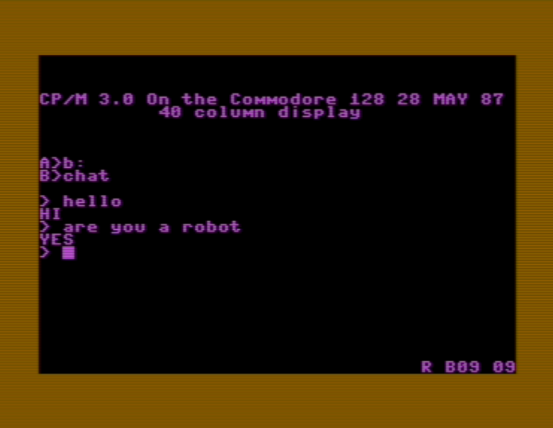

# Z80-μLM: A Retrocomputing Micro Language Model

Z80-μLM is a 'conversational AI' that generates short character-by-character sequences, with quantization-aware training (QAT) to run on a Z80 processor with 64kb of ram.

The root behind this project was the question: how small can we go while still having personality, and can it be trained or fine-tuned easily? With easy self-hosted distribution?

The answer is Yes! And a 40kb .com binary (including inference, weights & a chat-style UI) running on a 4MHz processor from 1976.

It won't pass the Turing test, but it might make you smile at the green screen.

For insight on how to best train your own model, see [TRAINING.md](TRAINING.md).

## Examples

Two pre-built examples are included:

### [tinychat](examples/tinychat/)

A conversational chatbot trained on casual Q&A pairs. Responds to greetings, questions about itself, and general banter with terse personality-driven answers.

```
> hello
HI
> are you a robot
YES
> do you dream
MAYBE
```

### [guess](examples/guess/)

A 20 Questions game where the model knows a secret topic and answers YES/NO/MAYBE to your questions. Guess correctly to WIN.



Includes tools for generating training data with LLMs (Ollama or Claude API) and balancing class distributions.

## Quickstart

Get running in under 5 minutes:

**1. Download** pre-built binaries from [GitHub Releases](../../releases)

**2. Install an emulator:**

| Platform | CP/M (.COM files) | ZX Spectrum (.TAP files) |
|----------|-------------------|--------------------------|
| **Linux** | [iz-cpm](https://github.com/ivanizag/iz-cpm/releases) | `apt install fuse-emulator-gtk` |
| **Windows** | [iz-cpm](https://github.com/ivanizag/iz-cpm/releases) | [Fuse](https://fuse-emulator.sourceforge.net/) |
| **macOS** | [iz-cpm](https://github.com/ivanizag/iz-cpm/releases) | `brew install fuse-emulator` |

**3. Run:**

- **CP/M**: `iz-cpm CHAT.COM`
- **ZX Spectrum**: `fuse --tape CHAT.TAP`, then `LOAD "" CODE` and `RANDOMIZE USR 32768`

For building from source or training your own models, see [TRAINING.md](TRAINING.md).

## Features

- **Trigram hash encoding**: Input text is hashed into 128 buckets - typo-tolerant, word-order invariant
- **2-bit weight quantization**: Each weight is {-2, -1, 0, +1}, packed 4 per byte
- **16-bit integer inference**: All math uses Z80-native 16-bit signed arithmetic
- **~40KB .COM file**: Fits in CP/M's Transient Program Area (TPA)
- **Autoregressive generation**: Outputs text character-by-character
- **No floating point**: Everything is integer math with fixed-point scaling
- **Interactive chat mode**: Just run `CHAT` with no arguments

## Platform Support

Z80-μLM runs on multiple Z80-based platforms:

- **CP/M**: Original target platform. Generates `.COM` files using `buildz80com.py`
- **ZX Spectrum 48K**: Full support via `buildz80tap.py`. See [ZX-SPECTRUM.md](ZX-SPECTRUM.md) for details
  - Generates `.TAP` files for emulators or real hardware
  - Uses ZX Spectrum ROM routines for I/O
  - Memory optimized for 48K systems
  - Compatible with most ZX Spectrum emulators

For ZX Spectrum builds, use `run-zx.sh` in example directories or see the [ZX Spectrum guide](ZX-SPECTRUM.md).

## Interaction Style

The model doesn't understand you. But somehow, it *gets* you.

Your input is hashed into 128 buckets via trigram encoding - an abstract "tag cloud" representation. The model responds to the *shape* of your input, not the exact words:

```
"hello there"  →  [bucket 23: 64, bucket 87: 32, ...]
"there hello"  →  [bucket 23: 64, bucket 87: 32, ...]  (same!)
"helo ther"    →  [bucket 23: 32, bucket 87: 32, ...]  (similar - typo tolerant)
```

This is semantically powerful for short inputs, but there's a limit: longer or order-dependent sentences blur together as concepts compete for the same buckets. "Open the door and turn on the lights" will likely be too close to distinguish from "turn on the door and open the lights."

### Small Responses, Big Meaning

A 1-2 word response can convey surprising nuance:

- `OK` - acknowledged, neutral
- `WHY?` - questioning your premise
- `R U?` - casting existential doubt
- `MAYBE` - genuine uncertainty
- `AM I?` - reflecting the question back

This isn't necessarily a limitation - it's a different mode of interaction. The terse responses force you to infer meaning from context or ask probing direct yes/no questions to see if it understands or not (e.g. 'are you a bot', 'are you human', 'am i human' displays logically consistent memorized answers)

### What It's Good At

- Short, varied inputs with consistent categorized outputs
- Fuzzy matching (typos, rephrasing, word order)
- Personality through vocabulary choice
- Running on constrained 8-bit hardware

### What It's Not

- A chatbot that generates novel sentences
- Something that tracks multi-turn context deeply
- A parser that understands grammar
- Anything approaching general intelligence

It's small, but functional. And sometimes that's exactly what you need.

## Architecture

- **Input**: 128 query trigram buckets + 128 context buckets
- **Hidden layers**: Configurable depth/width, e.g., 256 → 192 → 128
- **Output**: One neuron per character in charset
- **Activation**: ReLU between hidden layers

### Quantization Constraints

The Z80 is an 8-bit CPU, but we use its 16-bit register pairs (HL, DE, BC) for activations and accumulators. Weights are packed 4-per-byte (2-bit each) and unpacked into 8-bit signed values for the multiply-accumulate.

The 16-bit accumulator gives us numerical stability (summing 256 inputs without overflow), but the model's expressiveness is still bottlenecked by the 2-bit weights, and naive training may overflow or act 'weirdly' without QAT.

### Z80 Inner Loops

The core of inference is a tight multiply-accumulate loop. Weights are packed 4-per-byte:

```z80
; Unpack 2-bit weight from packed byte
ld a, (PACKED)      ; Get packed weights
and 03h             ; Mask bottom 2 bits
sub 2               ; Map 0,1,2,3 → -2,-1,0,+1
ld (WEIGHT), a

; Rotate for next weight
ld a, (PACKED)
rrca
rrca
ld (PACKED), a
```

The multiply-accumulate handles the 4 possible weight values:

```z80
MULADD:
    or a
    jr z, DONE       ; weight=0: skip entirely
    jp m, NEG        ; weight<0: subtract
    ; weight=+1: add activation
    ld hl, (ACC)
    add hl, de
    ld (ACC), hl
    ret
NEG:
    cp 0FFh
    jr z, NEG1       ; weight=-1
    ; weight=-2: subtract twice
    ld hl, (ACC)
    sbc hl, de
    sbc hl, de
    ld (ACC), hl
    ret
NEG1:
    ; weight=-1: subtract once
    ld hl, (ACC)
    sbc hl, de
    ld (ACC), hl
    ret
```

After each layer, arithmetic right-shift by 2 to prevent overflow:

```z80
sra h        ; Shift right arithmetic (preserves sign)
rr l
sra h
rr l         ; ACC = ACC / 4
```

That's the entire neural network: unpack weight, multiply-accumulate, shift. Repeat ~100K times per character generated.

---

License: MIT or Apache-2.0 as you see fit.
